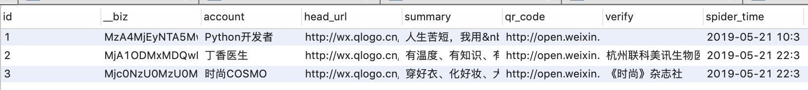
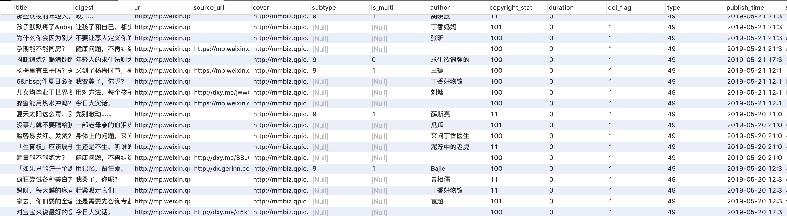
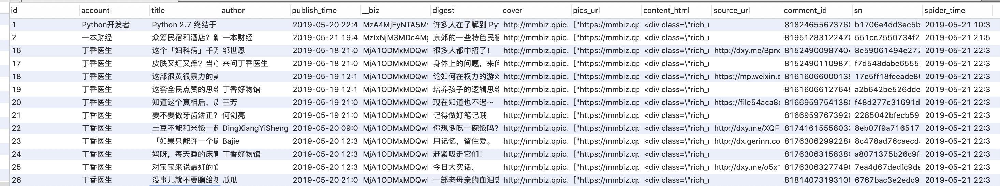
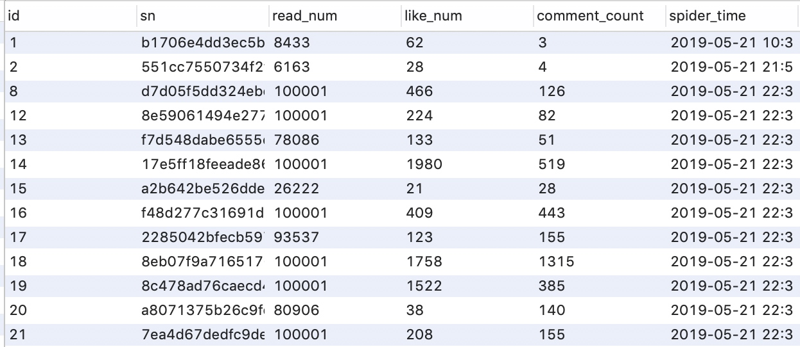
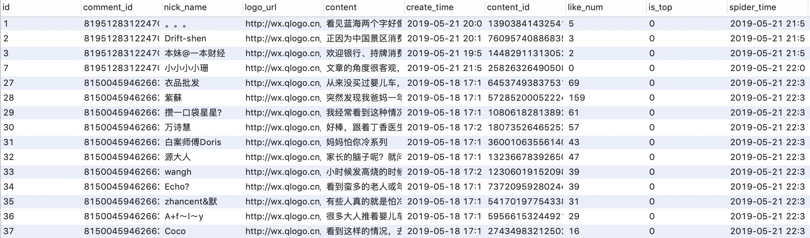
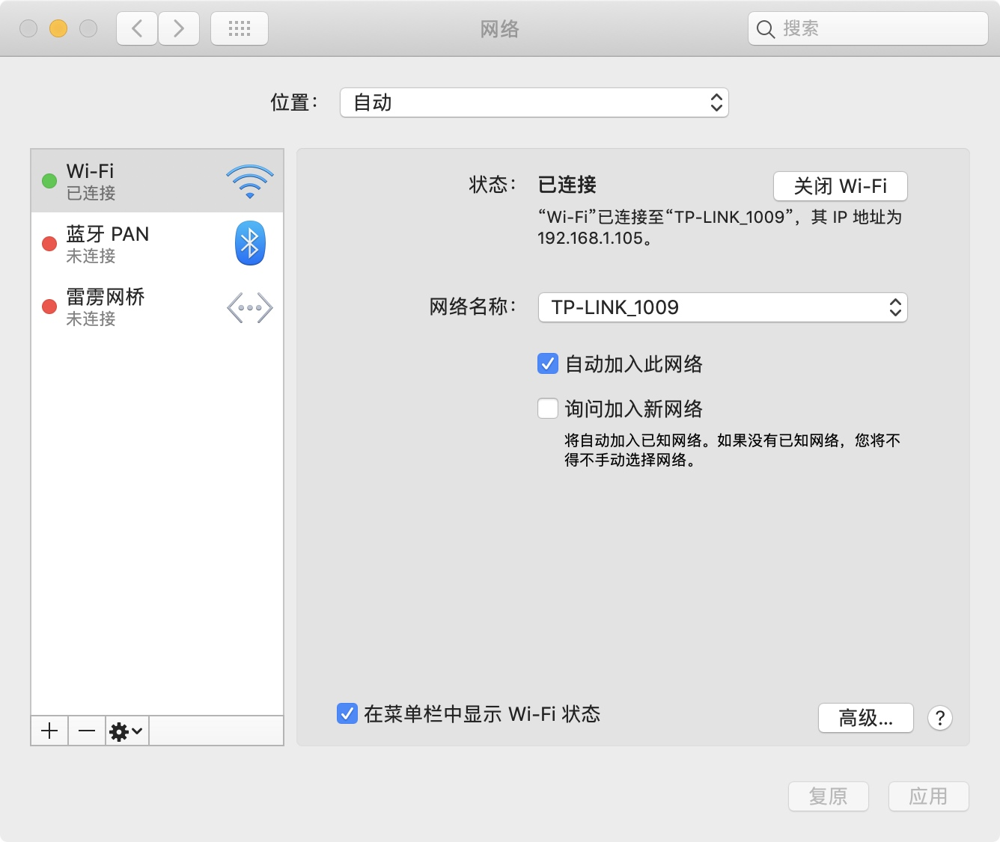
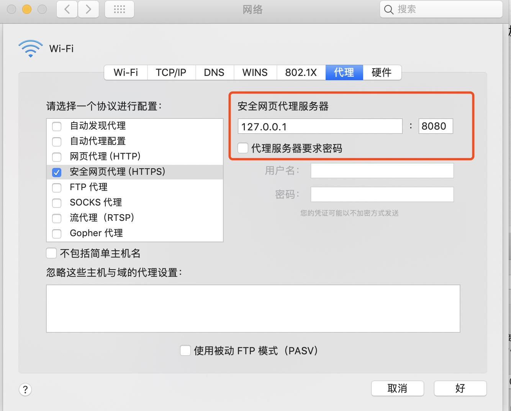
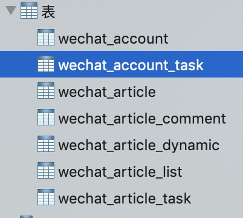
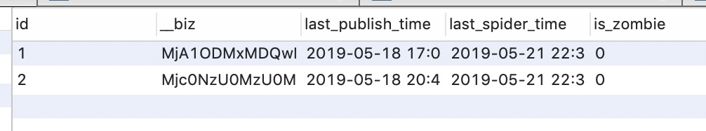
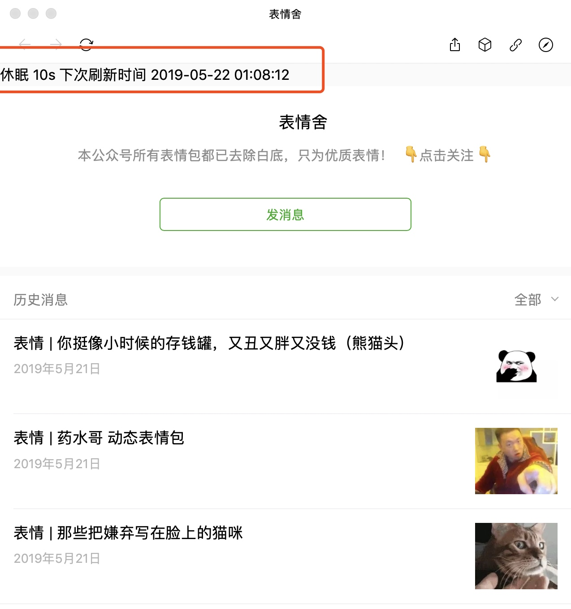

# 微信爬虫

## 功能：

- [x] 检测公众号每日新发文章
- [x] 抓取公众号信息
- [x] 抓取文章列表
- [x] 抓取文章信息
- [x] 抓取阅读量、点赞量、评论量
- [x] 抓取评论信息
- [x] 临时链接转永久链接

## 特色：

1. **免安装**：支持mac、window，双击软件即可执行
2. **自动化**：只需要配置好待监控的公众号列表，启动软件后即可每日自动抓取公众号及文章等信息
3. **好对接**：抓取到的数据使用mysql存储，方便处理数据
4. **不漏采**：采用任务状态标记的方式，防止遗漏每一个公众号、每一篇文章
5. **分布式**：支持多个微信号同时采集，微信客户端支持Android、iphone、Mac、Window 全平台

## 数据示例

**1. 公众号数据**

**2. 文章列表数据**

**3. 文章数据**

**4. 阅读点赞评论数据**

**5. 评论数据**

## 所需环境

1. mysql：用来存储抓取到的数据以及任务表
2. redis：任务缓存，减少操作mysql的次数

## 安装配置

> 以下安装说明安需查看，仅作为参考。因每个人环境不同，可能安装会有些差异，可参考网上的资料

### 1. 安装mysql
#### 1.1 window
#### 1.2 mac
### 2. 安装redis
#### 2.1 window
#### 2.2 mac
### 3. 安装证书
#### 3.1 iphone
#### 3.2 android
#### 3.3 window
#### 3.4 mac

### 4. 配置代理

> 如果使用手机，需要确保手机和运行wechat-spider的电脑连接在同一个路由器上

#### 3.1 iphone

打开设置-无线局域网-所连接的Wifi-配置代理-手动
填上该安装服务器的IP和端口8080

#### 3.2 android

打开设置-WLAN-长按所连接的网络-修改网络-高级选项-手动
填上该安装服务器的IP和端口8080

#### 3.3 window
#### 3.4 mac

打开系统配置（System Preferences.app）- 网络（Network）- 高级（Advanced）- 代理（Proxies）- Secure Web Proxy(HTTPS)
填上该安装服务器的IP和端口8080

## 使用说明

### 1. 安装如上说明安装好证书及配置好代理
### 2. 正确配置config.yaml

主要是配置mysql及redis的链接信息，确保能正确链接上

### 3. 启动wechat-spider

此步骤如果config里的auto_create_tables值为true时，会自动创建mysql数据表。建议首次启动时设置为true，创建完表后设置为false
    
### 4. 下发公众号任务

录入数据到wechat_account_task, 如：

只填写__biz就好

### 5. 点击任意一公众号，查看历史消息

当出现如上红框中的提示信息时，说明大功告成了，过一会可以去数据库里验证数据了

技术交流
----
若大家有什么疑问或指教，可加qq群，一起讨论问题。请备注`微信爬虫学习交流`

